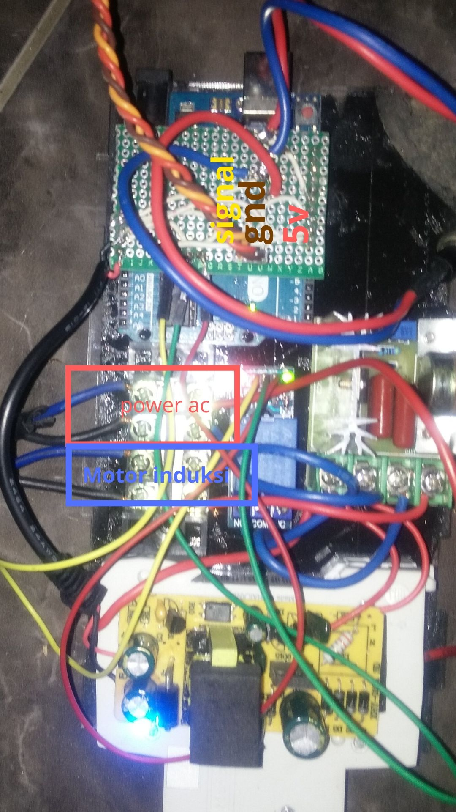

# Project Peniris Bawang Bima
Project ini membuat alat elektromekanik untuk peniris bawang. Dengan berkolaborasi antara Notasi Visual dan ColekmesDev


# Rangkaian Elektronik


Rangkaian Elektronik dalam bentuk PDF bisa [klik disini](Circuit/RangkaianElektronikPeniris.pdf)


## Program Arduino

<br>
Skema Program berdasarkan Finite State Machine gambar diatas. Program pada arduino bisa [klik disini](Code/Code.ino). Untuk mengganti beberapa paramater yang digunakan bisa diedit pada program pada blok seperti ini :

```c
    // -------- EDITABLE SPACE --------
    
    // Servo Control
    
    Servo myservo;
    
    int normal_position = 0;
    
    int niris_position = 90;
    
    int jumlahGoyang = 2;
    
    //Deklerasi Sistem Waktu Sistem dalam millisecond
    
    unsigned long time;
    
    unsigned long previousMillis=0; // Pencatat ingatan waktu
    
    // unsigned long intervalGoyang = 10000; // contoh untuk Setiap 10 detik saringan goyang
    
    unsigned long intervalGoyang = 10000;
    
    // unsigned long intervalMuter = 5000; // contoh untuk Setiap 5 detik muter
    
    unsigned long intervalMuter = 5000;
    
    // -------- EDITABLE SPACE --------
```
Selain itu untuk menguji semua input (tombol) dan aktuator (relay, dan servo) bisa [klik disini](CodeHardwareTest/CodeHardwareTest.ino)

# Aplikasi Pendukung

 1. [KiCad](http://kicad-pcb.org/) sebagai pembuat skematik
 2. [draw.io](https://www.draw.io/) sebagai aplikai pembuat diagram
 3. [Arduino IDE](https://www.arduino.cc/)  sebagai IDE untuk memprogram Arduino UNO

# Partner Terlibat


<!--stackedit_data:
eyJoaXN0b3J5IjpbMjY4MDk5NTA0LC0yNjc5NzAyODQsLTYwNz
IwMDIzLDc3OTkzNTE3MiwtMTI4MjQxMDcxMCwzNTE2MDI3Mzks
LTEyNTIxMDc1ODUsLTQxNzg3MTk2NywtMTA5NjM2NzkxNiwtMT
A5NjM2NzkxNiwtNDY4Mjg3NDM4LC0xNzY0NjM0OTkyXX0=
-->